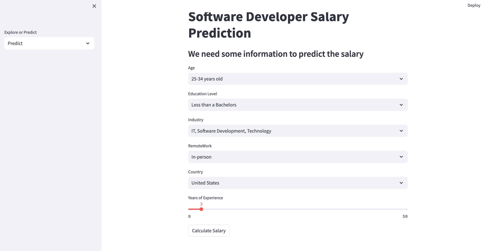
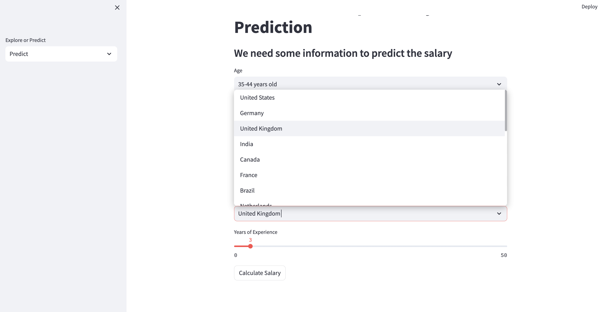
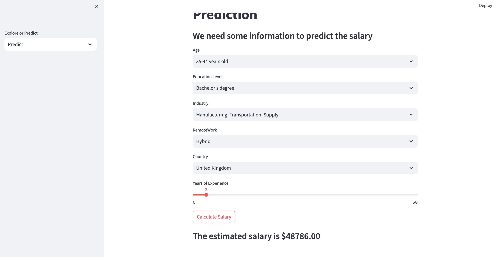
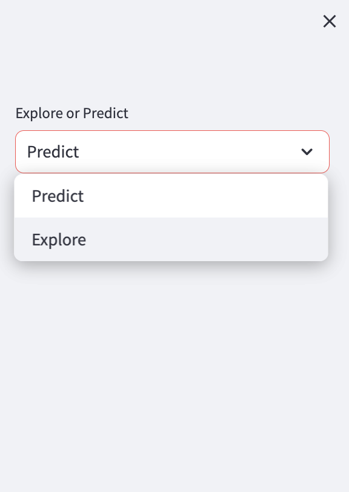
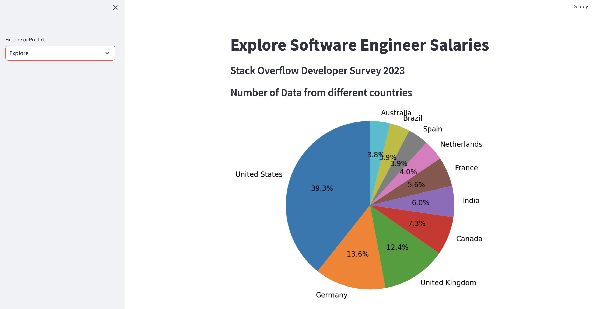
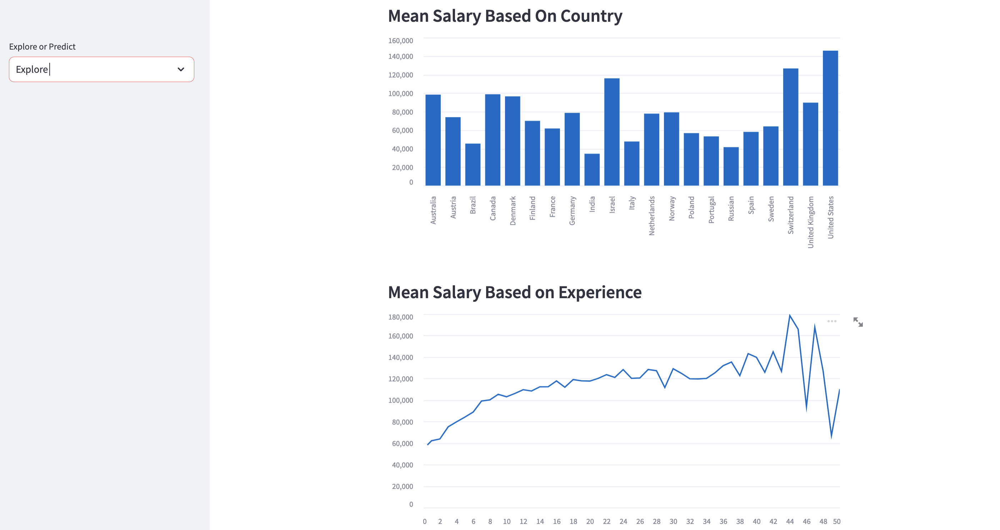

<div align="center">
    <h1>Salary Application</h1>
</div>

## A machine learning application to predict the annual salary of full-time software engineers.

### Introduction
#### Stack Overflow Annual Developer Survey
In May 2023 over 90,000 developers responded to Stack Overflow annual survey about how they learn and level up, which tools they're using, and which ones they want.
[Survey](https://insights.stackoverflow.com/survey)


### Repository Structure
* **README.md**: The top-level README for reviewers of this project
* **requirements.txt**: requirements file; including the needed tools
* **notebooks**: Jupyter notebooks: `01.data_exploration.ipynb` exploring the features that I selected to train my model. `02.processing_model.ipynb` processing the selected features and training the model.
* **data folder**: has a file how to download the dataset to run the notebooks.
* **predict_page.py**: Model interface.
* **explore_page.py**: Exploration inferface.
* **app.py**: Project application.

### Libraries
* pandas
* NumPy
* scikit-learn
* streamlit
* xgboost

## Getting the app running locally
1. Colone this repo
```
git clone https://github.com/khalidsbn/salary-app.git
```
2. Create and activate a virtual environment
```
python3 -m venv .venv
source .venv/bin/activate
```
3. Install the required dependencies (pandas, NumPy, etc)
```
pip install -r requirements.txt
```
4. Run `app.py`
```
streamlit run app.py
```


Running the above command should result in you seeing the following:



This is the interface of the Salary app:

6. Try to enter the information that matches your current situation.



7. Click on Calculate salary to get the prediction.



8. You can see some information about the dataset by clicking on the menu on the left side:



9. Here are some graphs from the data used in the training of the model:





